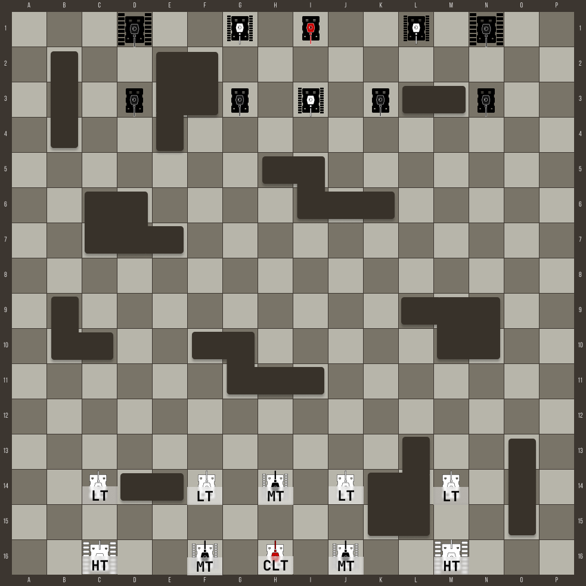

# Идея и описание игры

Порт настольной игры **Tank Chess** на веб платформу

- [Сайт игры](https://www.gamesforsage.com/product-page/tank-chess-standard)
- [Правила](https://disk.yandex.ru/i/P9OQA0kgY6GKEQ)
- [Брошура](https://disk.yandex.ru/i/NtZyokw2bufphA)
- [Видео с игровым процессом](https://www.youtube.com/watch?v=DiXfoXQX3-M)

# Реализация

Ниже описана упрощенная версия правил, которая планируется к реализации

## Состав игры
- доска 16x16 клеток с препятствиями. препятствия находятся на фиксированных позициях
- два игрока
- 20 таков разных типов. У каждого игрока по 10 танков. Каждый тип танка обладает своими характеристиками

### Характеристики танков разных типов и их количество танков на одного игрока:

| Тип танка    | Количество | Условное обозначение | Атака | Защита | Энергия |
| ------------ |:----------:|:--------------------:|:-----:|:------:|:-------:|
| Командирский |     1      |         CLT          |   3   |   3    |    5    |
| Легкий       |     4      |          LT          |   3   |   3    |    5    |
| Средний      |     3      |          MT          |   4   |   4    |    4    |
| Тяжелый      |     2      |          HT          |   5   |   5    |    3    |

### Цель игры

Поразить командирский танк противника

## Процесс игры

Игра начинается с расстановки фигур на поле

### Начальная положение фигур на поле

## Механика ходов

Игроки ходят по очереди. Первыми ходят белые

За один ход можно осуществлять действия только одним танком

Выбранный танк должен совершить от `1` до `n`(включительно) действий, где `n` - 'Энергия' танка в списке его характеристик.
Одно действие это:
- поворот влево на 45°
- поворот вправо на 45°
- шаг вперед по направлению движения танка. Если танк повернут на 45°, то шаг осуществляется по диагонали. Передвижение по полю можно осуществлять только в свободные от препятствий и других танков клетки
- шаг назад по направлению движения танка
- выстрел прямо по направлению движения. Расстояние не ограничено, но снаряд летит до первого препятствия. Выстрел можно совершить, только если имеется цель в виде вражеского танка

*Пример*
За один ход легкий танк может из своего стартого положения на доске:
1. сделать шаг вперед
2. повернуть на 45° вправо
3. повернуть на 45° вправо
4. сделать шаг вперед

И на этом закончить ход. Несмотря на то что у `LT` энергия равна 5, ход можно заканчивать досрочно, главное совершить хотя бы 1-но действие.

### Механика выстрела

Если прямо по направлению движения танка находится вражеский танк, то можно совершить выстрел.

Если параметр атаки атакующего танка больше, чем параметра защиты атакуемого танка, то после выстрела танк считается поверженным. Такой танк теряет возможность совершать какие-либо действия. Но остается на поле в качестве препятствия.

Если пораженным танком оказался командирский(`CLT`) танк противника, то игра считается оконченной, а игрок с 'выжившим' командирским танком - победителем

## Подсчет очков

По окончании игры на основе количества собственных уцелевших танков и пораженных танков противника оcуществляется подсчет очков.

| Тип танка | Стоимость |
|:---------:|:---------:|
|    CLT    |   5000    |
|    HT     |    800    |
|    MT     |    600    |
|    LT     |    400    |

За каждый пораженный танк противника в итоговый рейтинг суммируется соответствующее кол-во очков
За каждый потерянный собственный танк из итогового рейтинка вычитается соотвествующее кол-во очков

Таким образом макимальное кол-во баллов, которое можно получить: $5000 + 800*2 + 600*3 + 400*4 = 10000$
При условии поражения всех танков противника и сохранении все собственных танков.

Минимальное кол-во баллов за победу: $5000 - 800*2 - 600*3 - 400*4 = 0$
При условии поражения только командирского вражеского танка, ценой потери всех собственных, кроме командирского

## Режимы игры
Для MVP планиеруется реализовать только режим PvP(игрок против игрока) на одном устройстве, так называемый 'Hotseat'

# Возможные улучшения
## Режимы игры
- [ ] PvP по сети
- [ ] PvE - игрок против окружения, т.е. компьютера

## Механика выстрела
- [ ] Возможность стрелять не только прямо, но и в напрявлении ±45° по направлению движения
- [ ] Влияние направления атаки на уровень защиты
атака с тыла -2 к защите
атака с боку -1 к защите

## Условие победы
- [ ] Выход собственным командирским танком за дальнюю границу доски считается прорывом и досрочным завершением игры
При этом победные очки вычисляются как сумма выживших собственных танков, исключая `CLT` + сумма пораженных такнов противника
Т.е. макисмальное кол-во очков при прорыве:
$800*2 + 600*3 + 400*4 + 800*2 + 600*3 + 400*4 = 10000$
При условии сохранения всех своих танков и уничтожении всех вражеских танков, кроме командирского
Минимальное количество очков: $0$
При условии потери всех собственных танков, не поразив ни одного танка противника

## Редактор карт
- [ ] Возможность задать пользовательскую расстановку препятсвий и танков на поле
